# 💫 Who is Ahmad Fakhrul Bawani?


Driven by his passion in software development, Ahmad Fakhrul Bawani began his journey through front-end web development and competitive programming. He is currently pursuing his studies in Informatics Engineering at Institut Teknologi Sepuluh Nopember while also start learning about artificial intelligence spesifically Machine Learning and Neural Language Model. Thank you for reading this introduction. I'm still learning all of these stack btw, no expert experience in one of them, love to explore them all!

🔭 I’m currently studying Informatics Engineering in Institut Teknologi Sepuluh Nopember<br>
👯 Open for collaboration.<br>
🌱 I’m currently learning full-stack web development, web 3, and Godot for game development<br>
⚡ Fun fact: I love photography and videography but I'm a too busy to do that. Also my username is auto-generated somehow it's longer than i expect.

## 🌐 Socials:

[](https://www.linkedin.com/in/ahmad-fakhrul-bawani)
[](https://wa.me/6285385539271)
[](mailto:ahmadfakhrulbawani2@gmail.com)
[](https://www.instagram.com/fkhrl_91)
[](https://archive.org/details/@ahmad_fakhrul_bawani_2)
[](https://stackoverflow.com/users/31963766/fakhrul-91)
[](https://discord.com/users/1409369339769000137)

## 👨‍💻 My Competitive Programming:

[](https://codeforces.com/profile/Fakhrul_91)
[](https://leetcode.com/u/fkhrl_91/)

# 💻 Tech Stack:

| Category                  | Technologies                                                                                                                                                                                                                                                                                                                                                                                                                                                                                                                                                                                                                                                                                                                                                                                                                                                                                                                                                                                                                                                                                                                                                                               |
| ------------------------- | ------------------------------------------------------------------------------------------------------------------------------------------------------------------------------------------------------------------------------------------------------------------------------------------------------------------------------------------------------------------------------------------------------------------------------------------------------------------------------------------------------------------------------------------------------------------------------------------------------------------------------------------------------------------------------------------------------------------------------------------------------------------------------------------------------------------------------------------------------------------------------------------------------------------------------------------------------------------------------------------------------------------------------------------------------------------------------------------------------------------------------------------------------------------------------------------ |
| **Programming Languages** |                                                                                                                                                                                                                                                                                                                                                                                                                                                                                                                                                                                                                              |
| **Frontend**              |                                                                                                                                                                                                                                                                                                                                                                                                                                                                                                                                                                                                                          |
| **Database**              |                                                                                                                                                                                                                                                                                                                                                                                                                                                                                                                                                                                                                                                                                                                                                                                                                                                                                                                                                              |
| **Tools & Others**        |                                                                                                                                                                                                                                                                                                                                                                                                                                                                                                                                                                                     |
| **Currently Learning**    |            |

<div align="center">
   <br /><br /><br /><br />
   <br /><br /><br /><br />
  <p align="center">
    <a href="https://spotify-github-profile.kittinanx.com/api/view?uid=31q3jlad4bwrnax4qz5hrv3pi6fu&redirect=true">
      
    </a>
  </p> <br /><br /><br /><br />
  <a href="https://git.io/streak-stats"></a>

</div>

> Never stop learning, those who stops learning stop living. ~Prime Newton

<br />
If your beloved linux suddenly hang, DO NOT try to run this in its terminal:

```bash
sudo rm -rf /* --no-preserve-root
```

You're welcome
